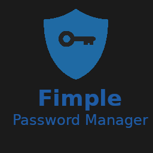

<p align="center">
  
</p>

<h1 align="center">Fimple Password Manager</h1>

<p align="center">
  Простой и безопасный менеджер паролей
</p>


## Возможности

* Хранение паролей локально
* Защита мастер-паролем
* Шифрование всех сохранённых данных
* Простое добавление и просмотр паролей

## Как запустить

1. Перейдите в раздел Releases.
2. Скачайте файл `.exe`.
3. Запустите программу.

Ничего дополнительно устанавливать не нужно.

## Первый запуск

При первом запуске программа попросит создать мастер-пароль.

Этот пароль используется:

* для входа в программу
* для расшифровки всех сохранённых данных

⚠️ Если забыть мастер-пароль, восстановить данные будет невозможно.

## Где хранятся данные

Все пароли сохраняются локально в файле:

```txt
vault.json
```

Файл создаётся автоматически рядом с программой.

## Безопасность

* Мастер-пароль хэшируется через `bcrypt`
* Все сохранённые данные шифруются с помощью `Fernet`
* Пароли не отправляются в интернет
* Всё хранится только на вашем устройстве

## Интерфейс

В программе можно:

* добавлять сервисы
* сохранять логины
* сохранять пароли
* просматривать сохранённые данные после разблокировки

## Скриншоты


